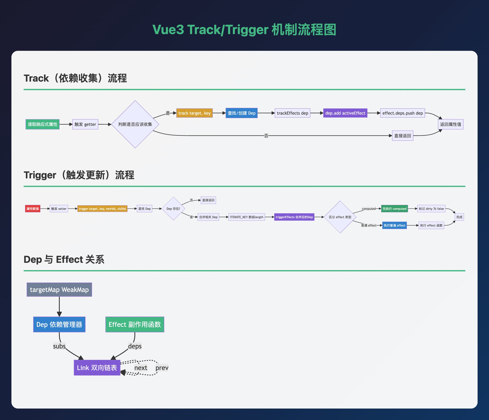

# Vue3 Reactivity 模块分析报告

## 1. 目录结构与入口 (Agent A)
入口 `src/index.ts` 统一导出：
- ref 系列（ref、shallowRef、toRef、toRefs、proxyRefs 等）
- reactive 系列（reactive、readonly、shallowReactive、shallowReadonly、markRaw、toRaw 等）
- computed 系列（computed）
- effect 系列（effect、track、trigger、stop、pauseTracking 等）
- 操作类型常量（TrackOpTypes、TriggerOpTypes）

## 2. 核心 API 实现 (Agent B)

### 2.1 ref.ts
- `RefImpl` 通过 getter/setter 拦截 `.value`，内部用 `Dep` 收集依赖，`_rawValue` 存原始值，`_value` 存响应式值（对象用 `toReactive` 转 Proxy）。
- 支持 `shallowRef`（浅层）、`unref`（提取值）、`proxyRefs`（对象中 ref 自动解包）、`toRef`/`toRefs`（reactive 属性转 ref）。

### 2.2 reactive.ts
- 用 `WeakMap` 缓存 Proxy（`reactiveMap`、`readonlyMap` 等），避免重复代理。
- `createReactiveObject` 根据目标类型选择 handlers（`mutableHandlers` / `mutableCollectionHandlers`）。
- 支持 `reactive`（深层）、`readonly`（深层只读）、`shallowReactive`/`shallowReadonly`（浅层）。
- 通过 `ReactiveFlags` 标识对象状态（`__v_isReactive`、`__v_isReadonly`、`__v_raw` 等）。

### 2.3 computed.ts
- `ComputedRefImpl` 内部用 `ReactiveEffect` 执行 getter，惰性求值（`_dirty` 标志），依赖变化触发重新计算。
- 支持只读与可写 computed。

### 2.4 effect.ts
- `ReactiveEffect` 包装用户函数，`run` 时设置 `activeEffect`、收集依赖、执行函数。
- `targetMap: WeakMap<target, Map<key, Dep>>` 全局存储依赖关系。
- `track` → `trackEffects` 将 `activeEffect` 加入 `Dep`。
- `trigger` 根据 `target/key` 取 `Dep`，特殊处理 `Map/Set` 的 `ITERATE_KEY` 与数组的 `length`，合并依赖后 `triggerEffects`。
- 支持 `scheduler` 自定义调度、`pauseTracking`/`enableTracking` 控制收集。

## 3. Track/Trigger 机制 (Agent C)
1. **Track**：读取响应式属性 → `track(target, key)` → 找/建 `Dep` → `trackEffects(dep)` → `dep.add(activeEffect)` + `effect.deps.push(dep)`。
2. **Trigger**：属性变化 → `trigger(target, key, newVal, oldVal)` → 找 `Dep` → 合并相关 Dep（如 `ITERATE_KEY`、`length`） → `triggerEffects(dep)` → 区分 `computed` 与普通 effect 执行。

## 4. 测试用例验证 (Agent D)
（待补充运行 `__tests__` 用例结果）

## 5. 关键流程图

### 5.1 Track（依赖收集）流程

### 5.2 Trigger（触发更新）流程

### 5.3 核心数据结构关系
- **依赖收集**：`activeEffect` → `track` → `Dep` → `effect.deps`
- **触发更新**：`trigger` → 合并 Dep → `triggerEffects` → `computed` → 普通 effect

## 6. 特殊场景
- 数组方法响应式：`arrayInstrumentations.ts` 特殊处理 `includes`、`indexOf`、`push`、`pop` 等。
- 集合类型：`collectionHandlers.ts` 对 `Map/Set/WeakMap/WeakSet` 做 Proxy 拦截。
